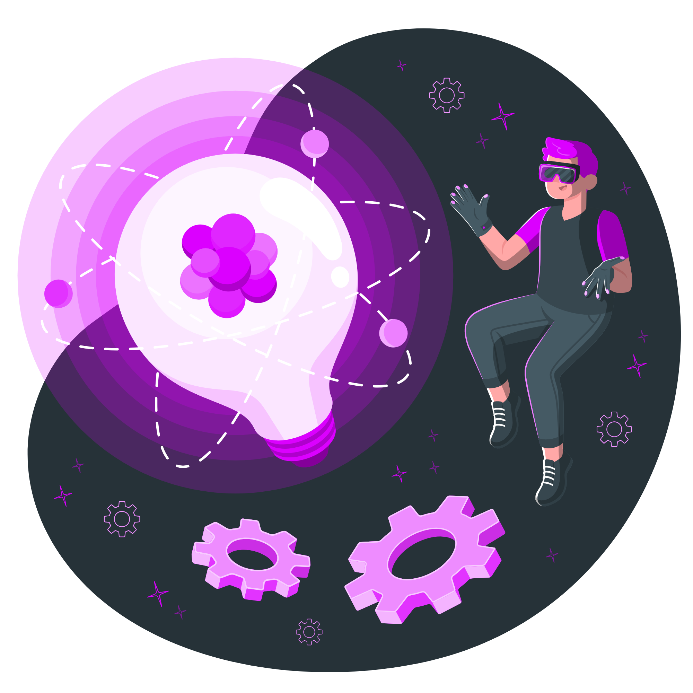
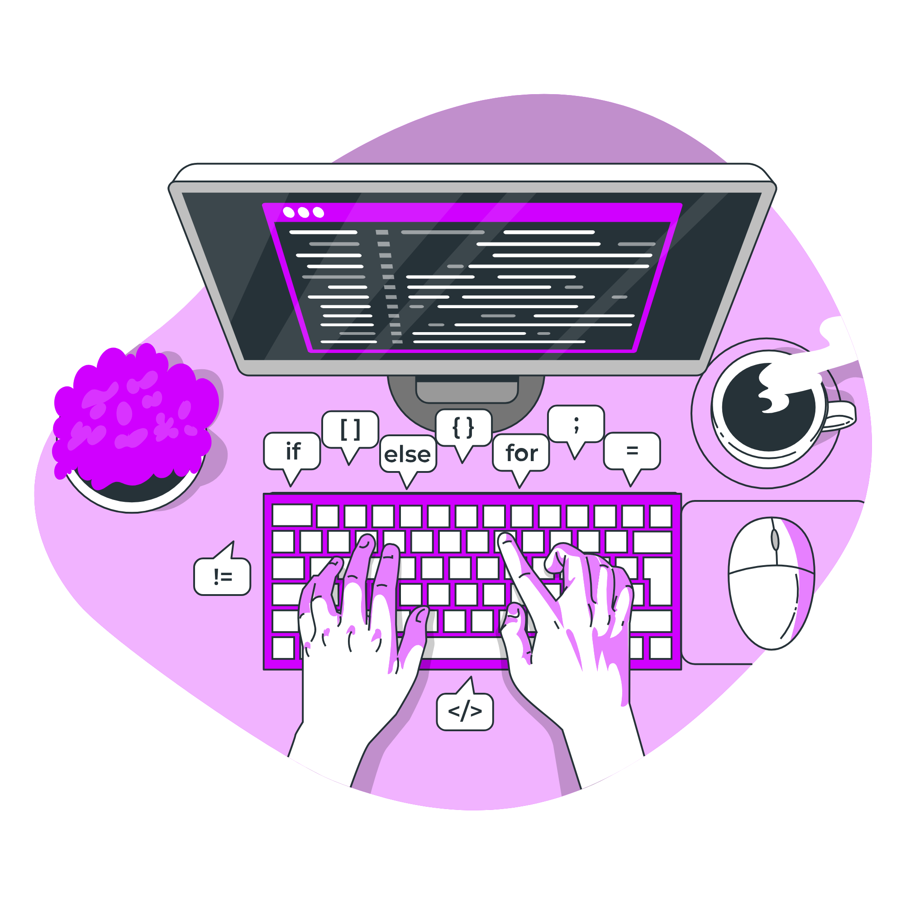

# 🦦 About me

👾 Hello! I'm Bruno Lopes, a Cybersecurity student in the fourth semester, dedicated to exploring and expanding my knowledge in the vast world of technology!

🌱 I constantly seek to learn and improve my skills in various areas, including software development, artificial intelligence, machine learning and information security. I firmly believe that continuous education and curiosity are key to success in this ever-evolving industry.

💼 Always open to new learning and collaboration opportunities! 

🚀 I'm excited to share my progress, projects, and contributions here on GitHub. Join me on this journey of learning and discovery!

## 👋 Connect with me
 
